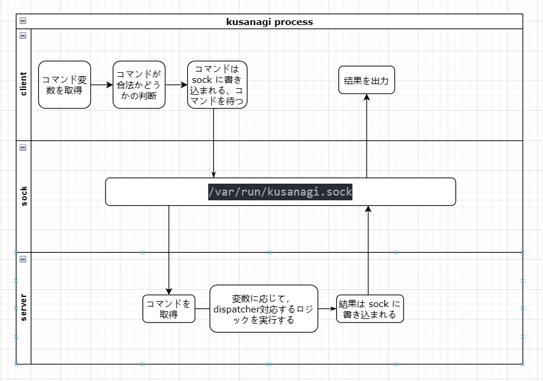
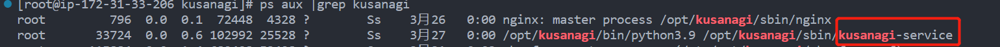
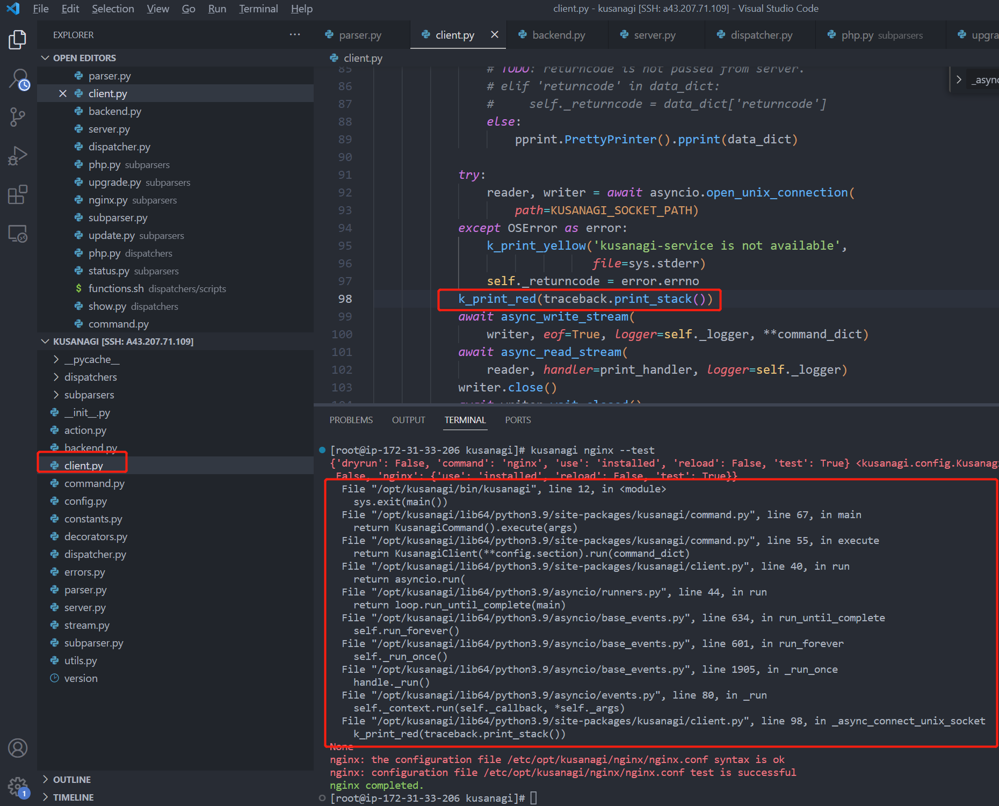
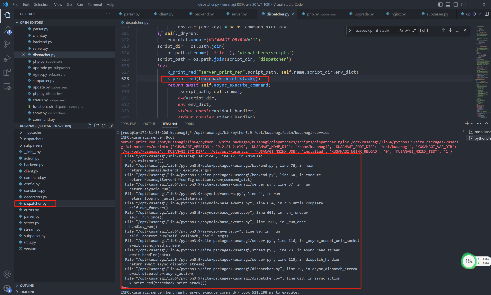

# kusagagi 運行プロセス理解

##　１、流れ図

#####　kusagagiは二つに分かれる、効果は以下の通り
serverとclientだ。server部分、常に実行，kusanagi.sock のデータ読み込みでループする，データの内容に応じて、対応するbashのスクリプト内の関数を実行する。

client部分は主にコマンドの正当性を判断する，簡単なコマンド（kusanagi -V）結果を直接返す，複雑なコマンドはkusanagi.sockに書き込む。
## 2，kusanagi nginx --testコマンドを通して実行プロセスを理解する
kusanagi nginx --testコマンドを通して実行プロセスを理解する，コードの構成を理解する。
> 使用した関数：
traceback.print_stack(): callstackを出力できる
k_print_red(): kusanagiのprint関数

##### 1、clientがデータを sock に送信する位置でcallstackを出力：

##### 関連する呼び出された関数の役割
1、最初に /opt/kusanagi/bin/kusanagi の 12 行目の main() 関数を呼び出し，次に、/opt/kusanagi/lib64/python3.9/site-packages/kusanagi/command.py の 67 行目を実行し，KusanagiClient クラスの run 関数,KusanagiClient クラスの __init 関数は config と log を初期化します。
2、55行目のexecute関数，主な機能は、各コマンドに対して正当な判断を下すこと
3、40行目のasyncio.run()はasyncioを使用する，asyncio は、高性能なネットワークとウェブサーバ、データベース接続ライブラリ。
4、asyncio.run()の関数は_async_connect_unix_socket，主な機能は複雑なコマンドはkusanagi.sockに書き込む。


##### 2、serverがコマンドを実行する位置でcallstackを出力：

##### 関連する呼び出された関数の役割
１、前のロジックはクライアントのロジックに似ている，主なロジックは/opt/kusanagi/lib64/python3.9/site-packages/kusanagi/server.py的116行だ、async_read_stream(reader, handler=dispatch_handler, logger=self._logger)の関数dispatch_handlerはデータに対して返されるハンドラー関数，この関数によって実行される async_dispatch_stream 関数，主なロジックは、dispatchers/scripts/dispatcher が bash ファイルを実行すること，例: kusanagi nginx --test は、dispatchers/scripts/dispatcher nginx を実行する。

## 3、コード フォルダーの理解
``` 
.
├── __init__.py
├── __pycache__
├── action.py
├── backend.py
├── client.py
├── command.py
├── config.py
├── constants.py
├── decorators.py
├── dispatcher.py
├── dispatchers
│   ├── __init__.py
│   ├── addon.py
│   ├── bcache.py
│   ├── configure.py
│   ├── dbinit.py
│   ├── fcache.py
│   ├── httpd.py
│   ├── init.py
│   ├── list.py
│   ├── migrate.py
│   ├── monit.py
│   ├── nginx.py
│   ├── php.py
│   ├── provision.py
│   ├── ratelimit.py
│   ├── remove.py
│   ├── restart.py
│   ├── ruby.py
│   ├── scripts
│   │   ├── MariaDB.repo
│   │   ├── deploy
│   │   │   ├── drupal.sh
│   │   │   ├── fcgi.sh
│   │   │   ├── lamp.sh
│   │   │   ├── mt.sh
│   │   │   └── wp.sh
│   │   ├── dispatcher
│   │   └── functions.sh
│   ├── setup.py
│   ├── show.py
│   ├── ssl.py
│   ├── stage.py
│   ├── status.py
│   ├── update.py
│   ├── upgrade.py
│   └── waf.py
├── errors.py
├── parser.py
├── server.py
├── stream.py
├── subparser.py
├── subparsers
│   ├── __init__.py 
│   ├── addon.py
│   ├── bcache.py
│   ├── configure.py
│   ├── dbinit.py
│   ├── fcache.py
│   ├── httpd.py
│   ├── init.py
│   ├── list.py
│   ├── migrate.py
│   ├── monit.py
│   ├── nginx.py
│   ├── php.py
│   ├── provision.py
│   ├── ratelimit.py
│   ├── remove.py
│   ├── restart.py
│   ├── ruby.py
│   ├── setup.py
│   ├── show.py
│   ├── ssl.py
│   ├── stage.py
│   ├── status.py
│   ├── update.py
│   ├── upgrade.py
│   └── waf.py
├── utils.py
└── version
``` 
commend.pyはクライアント部分のエントリ
server.pyはserver部分のエントリ
dispatchersフォルダは、各種コマンドに対応した実行機能
dispatchers/scripts/dispatcher はbashファイルで、最後のコマンドに対応するロジック
subparsersフォルダは各種コマンドの正当性判定ロジック
## 4、その他